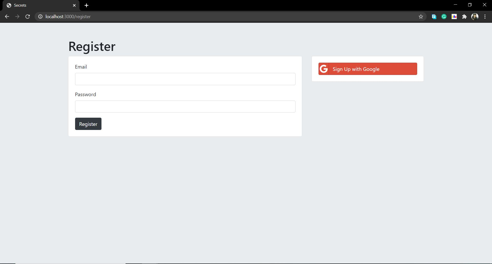
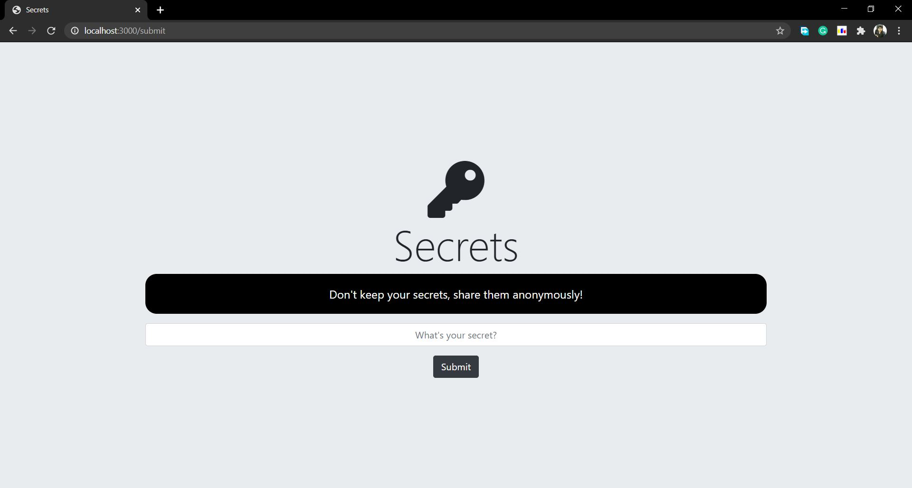

<link rel="stylesheet" href="https://maxcdn.bootstrapcdn.com/bootstrap/3.4.1/css/bootstrap.min.css">
# Secrets

<h3>Secrets is a web app in which you can submit your secrets anonymously and see others' secrets without knowing whose secret it is.</h3>
<h2>Technology Used: </h2>
<ul>
  <li><h3><a href="https://developer.mozilla.org/en-US/docs/Web/HTML">HTML</a></h3></li>
  <li><h3><a href="https://developer.mozilla.org/en-US/docs/Learn/CSS">CSS</a></h3></li>
  <li><h3><a href="https://developer.mozilla.org/en-US/docs/Web/JavaScript">JavaScript</a></h3></li>
  <ul>
    <li><h3><a href="https://nodejs.org/en/">nodeJS</a></h3></li>
    <li><h3><a href="https://expressjs.com/">expressJS</a></h3></li>
    <li><h3><a href="https://ejs.co/">EJS</a></h3></li>
  </ul>
  <li><h3><a href="https://www.mongodb.com/1">Database</a></h3></li>
  <ul>
    <li><h3><a href="https://www.mongodb.com/1">MongoDB</a></h3></li>
    <li><h3><a href="https://mongoosejs.com/">mongooseJS</a></h3></li>
  </ul>
  <li><h3><a href="https://developers.google.com/identity/protocols/oauth2">Authentication</a></h3></li>
  <ul>
    <li><h3><a href="https://developers.google.com/identity/protocols/oauth2">Google OAuth 2.0</a></h3></li>
    <li><h3><a href="http://www.passportjs.org/packages/passport-google-oauth20/">passportJS</a></h3></li>
    <li><h3><a href="https://www.npmjs.com/package/bcrypt">bcrypt</a></h3></li>
    <li><h3><a href="https://www.npmjs.com/package/dotenv">dotenv</a></h3></li>
  </ul>
  <li><h3><a href="https://git-scm.com/">Version Control</a></h3></li>
  <ul>
    <li><h3><a href="https://git-scm.com/">Git</a></h3></li>
    <li><h3><a href="https://github.com/">GitHub</a></h3></li>
  </ul>
</ul>

<h2>Website snaps</h2>

<h2>Usage</h2>
<ol>
  <li><h3>Install nodeJS</h3></li>
  <li><h3>Install npm</h3></li>
  <li><h3>Install mongo</h3></li>
  <li><h3>run command:> npm install</h3></li>
  <li><h3>run command:> node app.js</h3></li>
</ol>
